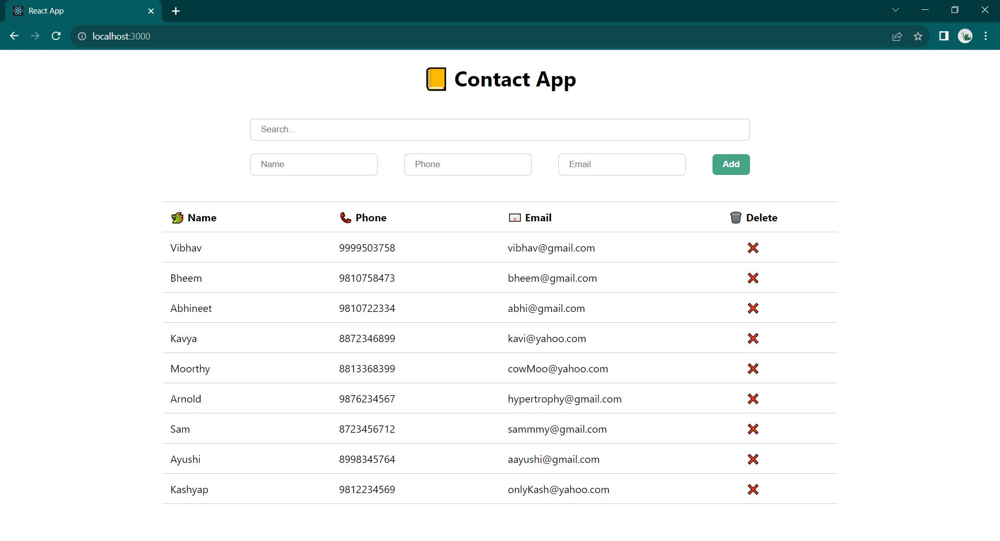
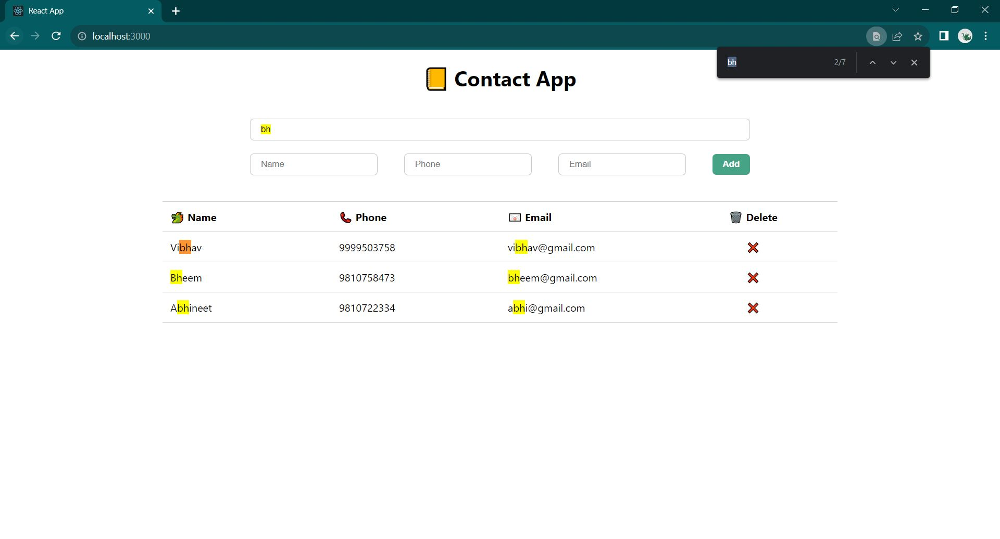

# React Contact App Project

Access this project live here --> https://vibhavk03.github.io/react-contacts-app/ 

- this is a simple contact app made using React 
- you can add a contact by filling in name, phone and email information 
- this app let you search contacts by name, phone or email 
- contact can also be delted by clicking on the cross button in the delte column 

## Tech Stack

- this project uses React library for building this contact app 
- styling is done using vanilla CSS 

## Technical Solutioning

- the contacts added in the app are saved in the local storage 
- this project uses useState hook to manage form and search box input 
- useEffect hook is used to save the latest contact list to the local storage 
